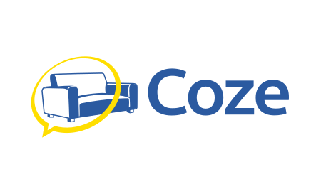

For Coz, please see the README in the [Main Coz Project.](https://github.com/Cyphrme/Coz)

For your project use `coze.min.js`.


# Developing CozJs
## How to Build
##### Install esbuild

If using Go, esbuild can be installed with the following.

```
go install github.com/evanw/esbuild/cmd/esbuild@v0.15.8
```

[Alternatively, see esbuild's installation instructions.][1]
Also, [CozJs npm](https://www.npmjs.com/package/coze).  

##### Create the Coz distribution file. 

(See [join.js](join.js) for more instructions.)
```
esbuild join.js --bundle --format=esm --minify --outfile=coze.min.js
cp coze.min.js verifier/coze.min.js
```

## Simple Coz Verifier
The simple verifier is self-contained in `/verifier`.

- [Cyphr.me   hosted Power  Coz Verifier](https://cyphr.me/coze)
- [Cyphr.me   hosted Simple Coz Verifier](https://cyphr.me/coze_verifier_simple/coze.html)
- [Github.com hosted Simple Coz Verifier](https://cyphrme.github.io/CozeJS/verifier/coze.html)

To run the simple verifier locally, especially useful for local development, use
the Go server.  

```sh
cd verifier
go run server.go
```

And then go to https://localhost:8082/coze.html in your browser. 


## Testing
CozJs uses <a href="https://github.com/Cyphrme/BrowserTestJS">BrowserTestJS</a>
for running unit tests in the browser. The test can run as a [Github
page.](https://cyphrme.github.io/CozeJS/verifier/browsertest/browsertest.html)

For local development, use the Go server. 

```sh
cd verifier/browsertest
go run server.go
```

Then go to `https://localhost:8082`.


# CozJs Gotchas
- ⚠️ **Constant Time** ⚠️- Javascript is not constant time.  Until there's something available
	with constant time guarantees, like [constant time
	WASM](https://cseweb.ucsd.edu/~dstefan/pubs/renner:2018:ct-wasm.pdf), this
	library will be vulnerable to timing attacks as this problem is inherent to Javascript.

- ⚠️ **Duplicates** ⚠️- Duplicate detection is unavailable for Javascript objects
	as Javascript objects always have unique fields with last-value-wins. (This of
	course does not apply to strings or any serialized UTF-8 form).  The
	solution CozJs uses is that String/UTF-8/serialized form must be checked for
	duplicates by calling function `CheckDuplicate`.  This is slow and
	unfortunate, but for security reasons required as different versions of
	Javascript have different behaviors.
	
	In ES5, duplicates should fail in strict mode, which is the correct behavior
	for a JSON parser.  ES6 experienced regression, and objects in ES6
	terrifyingly permit duplicate fields with last-value-wins.  
	This is the wrong design decision for a plethora of reasons and the correct
	behavior is error-on-duplicate, but there's nothing we can do about that on
	our side without implementing our own primitives.  As currently designed, no
	JSON parsing is done within CozJs, and so CozJs inherits the
	last-value-wins behaviour from Javascript, thus the CozJs provided function
	`CheckDuplicate` must be called for correct behavior.  See notes on
	`test_Duplicate`.
	
	See also https://github.com/json5/json5-spec/issues/38#issuecomment-1224158640
 and https://262.ecma-international.org/5.1/#sec-C > It is a SyntaxError if
	strict mode code contains an ObjectLiteral with more > than one definition of
	any data property (11.1.5).


- **ES224 is not supported**.  Even though [FIPS
	186](https://nvlpubs.nist.gov/nistpubs/FIPS/NIST.FIPS.186-4.pdf) defines
	curves P-224, the [W3C recommendation omits
	it](https://www.w3.org/TR/WebCryptoAPI/#dfn-EcKeyGenParams) and thus is not
	implemented in Javascript.  The Javascript version of CozJs will probably only
	support ES256, ES384, and ES512.  

- **Ed25519** — The W3C Web Cryptography API recommendation omits Ed25519, so an
	external package that implements the Ed25519 primitive is needed.  CozJs uses
	[Paul Miller's noble-ed25519](https://github.com/paulmillr/noble-ed25519),
	which provides Ed25519ph (prehash) support needed for Coz's digest-then-sign
	architecture.  The upcoming [FIPS
	186-5](https://nvlpubs.nist.gov/nistpubs/FIPS/NIST.FIPS.186-5-draft.pdf)
	specifies Ed25519 support, which may eventually bring native SubtleCrypto
	Ed25519 to browsers.

- Javascript's `SubtleCrypto.sign(algorithm, key, data)` always hashes a message
	before signing while Go's ECDSA expects a digest to sign. This means that in
	Javascript messages must be passed for signing, while in Go only a digest is
	needed.


----------------------------------------------------------------------
# Attribution, Trademark Notice, and License
Coze and CozeJS are released under The 3-Clause BSD License. 

"Cyphr.me" is a trademark of Cypherpunk, LLC. The Cyphr.me logo is all rights
reserved Cypherpunk, LLC and may not be used without permission.

Coz is an open source project.  Use at your own risk.


[1]:https://esbuild.github.io/getting-started/#build-from-source