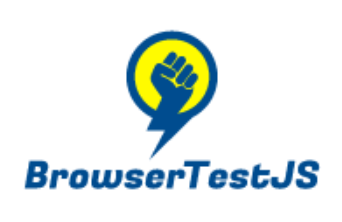

# BrowserTestJS 


Run unit tests in the browser.

## [Demo](https://cyphrme.github.io/BrowserTestJSExample/browsertestjs/test.html)

[Example demo repository](https://github.com/Cyphrme/BrowserTestJSExample).

Example from `test_unit.js` in [Coze js](https://github.com/Cyphrme/Cozejs).


# How to use BrowserTestJS

### How to structure within a repo

Import BrowserTestJS as a submodule to the project.

The following example will demonstrate cloning into the root of the project:

``` sh
git submodule add git@github.com:Cyphrme/BrowserTestJS.git browsertestjs
```
Which will add `browsertestjs` to the following project:

```dir
my_awesome_project /
 ├─ My_File.html
 ├─ My_File.js
 ├─ ...
 └─ browsertestjs /
```

Write your tests in `test_unit.js` (above the `browsertestjs` directory).  You may use `test_unit.js.example` as a starting template.

```dir
my_awesome_project /
 ├─ My_File.html
 ├─ My_File.js
 ├─ ...
 ├─ test_unit.js
 └─ browsertestjs /
```

The file `test_unit.js` and directory `browsertestjs` are for BrowserTestJS.

## To update the submodule
When changes are made to BrowserTestJS, a project can update the changes by
running the following command from the directory where the project's .gitmodules
lives:

```sh
git submodule update --remote
```

## Having issues with submodules?
[See if this resolves the issue](https://stackoverflow.com/a/35778105/15147681)

## Run tests locally with a local HTTP server
You must have Go installed on your local machine.

```sh
cd $my_awesome_project/browsertestjs
go run server.go
```

Then, go to `localhost:8082`.  Voila! You now have unit tests for your projects
directly in the browser.

### Building `test_unit.js`

There are three parts to each test:
1. ) Writing the "schema" of the test, which includes:
    - The Name of the test, which is the name used to differ tests and shows in browser.
    - The Function of the test, which is the test function testing something in your source code.
    - The Golden results of the test, which is the expected behavior/results from running your test function.
2. ) Writing the test function that tests your source code.
3. ) Invoking the test by placing the test schema in the `TestsToRun` variable.

The `TestGUIOptions` is an optional parameter and is not required for
TestBrowserJS. `TestGUIOptions` includes stylesheet options for your project.

See `test_unit.js.example` for an example of a unit test file.

See `test_unit.js.template` for a starting template for building a unit test
file.

## Example from `test_unit.js` in [Coze js](https://github.com/Cyphrme/Cozejs).

## Logo license
"you are free to use your logo for promotional purposes"
https://support.freelogodesign.org/hc/en-us/categories/360003253451-Copyrights


----------------------------------------------------------------------
# Attribution, Trademark notice, and License
BrowserTestJS and ExampleBrowserTestJS is released under The 3-Clause BSD License. 

"Cyphr.me" is a trademark of Cypherpunk, LLC. The Cyphr.me logo is all rights
reserved Cypherpunk, LLC and may not be used without permission.